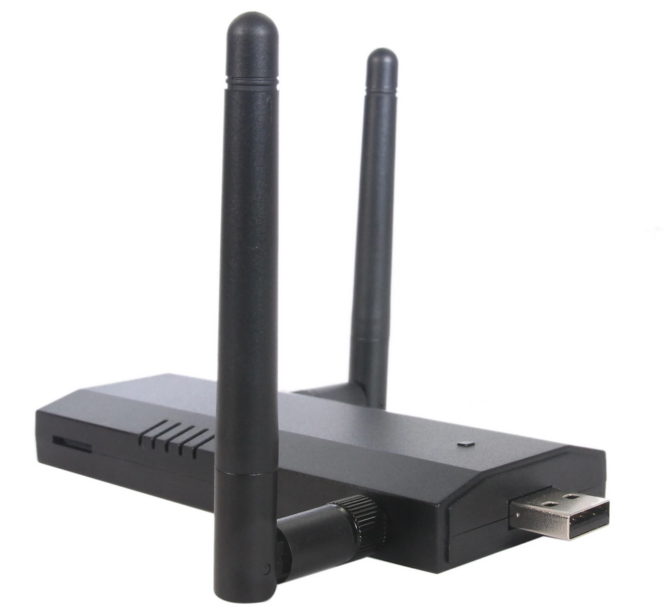
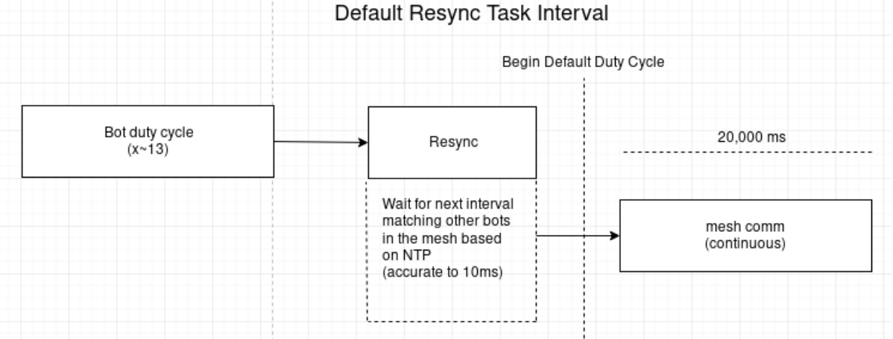

# Wireless Implant C2 for Security Operations

## Proliferation

Since the mass adoption of wireless networks in the early 2000s, wireless standards bodies such as the WiFi Alliance have become the linchpin for the proliferation of affordable, interoperable commercial & enterprise wireless devices. While the convenience and universality of such devices cannot be denied, transparency and security often become a forethought throughout their conception.&#x20;

The result is standards and norms which cement themselves in IT operations all across the world, giving what many offensive researchers view as a an easy win in terms of establishing repeatable, predictable attack surfaces in enterprises and small businesses alike. As they researched and released untold numbers of exploits over the course of the last two decades, defenders have found their infrastructure to be blindsided time and time again. Misassociation, deauthentication, and key reinstallation are a just a few classes of wireless attacks which have become a thorn in the side of IT teams.


## The Low-Hanging Fruit

[Rogue access points](https://en.wikipedia.org/wiki/Rogue\_access\_point) are a misconfigured or maliciously placed wireless access point, generally considered to be hidden or obscured under the intended hardware baseline. They often come in small, clandestine form factors such as the Hak5 Pineapple or a Raspberry Pi. These devices are generally considered the low-effort avenue for an adversary to gain initial access into a target network, as the challenge is primarily planting the device itself and retaining access. They are almost always attacker controlled, and if placed correctly are very difficult to locate.



Simple 'gotcha' misassociation attacks such as the infamous Evil-Twin or MANA can make quick work for compromising employee endpoints and collecting the information necessary to gain a foothold on an otherwise secure network. There are many defense-in-depth measures & configurations, enterprise-grade hardware and techniques that can be leveraged to prevent many of the common pitfalls.&#x20;

Rogue access points can also be located by physically triangulating various wireless signals, [as presented in my research with Todd at DEFCON 26](https://www.youtube.com/watch?v=jGYrE3Jw-e0). When the access points become mobile, such as in an attacker's backpack or on a drone, or in the less than non-conspicuous WiFi Cactus wielded by [d4rkm4tter](https://twitter.com/d4rkm4tter), the following challenges become apparent:

* Identifying the wireless signature of the device. This could be a BSSID or a beacon/probe cadence with a specific pattern of targets. It also includes a specific frequency and channel(s).
* Fast moving.
* Structural and wireless interference requiring additional tuning.
* Large area to cover - multiple choke points with many potential sources of signal noise / attenuation.

The scope of the research performed below encompasses a novel approach to both detection and offense of common attacks seen in the wild, as perpetrated by hard-to-find/catch rogue access points.

## The Implant C2 Approach

Given the logistic impossibility of hunting rogue access points at scale on foot, we required a framework of wireless data ingestion that fit the following parameters:

* Worked over a large distributed area, with multiple nodes collecting data
* Continuous data ingestion & monitoring
* Command & control capability
* Concealable & cheap
* Easy to take on the move

This would allow for proactive, large-scale data ingestion, as well as offensive command and control channels for distributed red teaming activities. The points of data we were interested in included:

* Baseline BSSID presence
* Source/Destinations of wireless probes
* Source of wireless beacons
* Physical locations of all of the above, by triangulating signal strength


## Project Parameters and Hardware

Since the project budget was rather small (and personal), we opted for the [ESP8266](https://www.espressif.com/en/products/socs/esp8266). It offers the following advantages:

* Full TCP/IP stack for $3-5
* Includes the easy to use EspressIf SDK
* 802.11b (2.4 GHz) capable
* 2 GPIO for Serial programming
* Very small

and the following disadvantages:

* No debugging capabilities at the time of conception
* 1MB RAM
* Power hungry, gets very hot
* Limited range

This project was  field tested at the DEFCON 26 wireless CTF, in an attempt to locate mobile rogue access points, dubbed "foxes". Thus, the project was dubbed "Fox Trap".&#x20;

### Hardware Prototypes

We iterated through a variety of prototypes, to program, deploy & conceal the implants.

#### **Prototype 1**


#### **Prototype 2&3**


#### **Prototype 3**


#### **Prototype 4**


## Software Considerations

The following were identified as key points in the selection process of a software stack:

* Open source support
* Robust Library Offerings
* Quick to leverage

Due to the need to operate in a large, noisy and highly dynamic RF environments, a mesh network seemed to be the best choice at hand due to the topological extensibility they offer. This would allow the software to fallback into alternate communication modes of our choosing, should a signal be be lost for any reason or if a message/alert failed to send any number of times.

[painlessMesh](https://gitlab.com/painlessMesh/painlessMesh) was chosen for its great documentation, comprehensive code base and good developer support. The mesh mode functions with the assumption of a single root node and a constantly changing wireless topology, consisting of "leaf" worker nodes in the network.


## Software Prototype

With the parameters set in motion for a mesh-based, WiFi C2 framework, the following 2 paradigms would be implemented:

### [Root node](https://github.com/joeminicucci/fox\_trap/tree/master/fox\_track/src) Design

Duties:

* Command & control bots
* Update target BSSID
* Collect and forward bot data

Software Stack:

* ArduinoJson
* painlessMesh&#x20;

### [Bot (Bi-Modal)](https://github.com/joeminicucci/fox\_trap/blob/master/fox\_bot/src/main.cpp) Design

Due to the lack of software interrupts being implemented in the [EspressIf SDK](https://www.espressif.com/en/products/software/esp-sdk/overview) at the time of development (perhaps this is due to a hardware limitation), running promiscuous mode for sniffing traffic, and inter-weaving seamlessly with communication mode for the mesh was not a possibility. Instead, I created a model in which the 2 modes would be logically separate, and synchronously communicate as necessary. This would ensure that when a signal alert was located by a bot, the whole network would be in constant synchronization to propagate the data back to the root node, and acknowledge the ingestion / re-synchronization across the mesh accordingly.

Sniff Mode:

* BSSID sniffer
* Probe sniffer
* Beacon sniffer

Mesh Mode:

* Communication responsibilities
  * Alert propagation
  * Signal Acknowledgments
  * Re-synchronization


### Bot Implementation - Initialization & Mesh Mode

The bot would function by first placing itself into mesh communication mode to talk to the mesh.

```cpp
void meshInitialization(){
    //keep the topology correct
    mesh.setRoot(false);
    mesh.setContainsRoot(true);
    mesh.onReceive(&receivedCallback);
    mesh.onNodeTimeAdjusted(&onTimeAdjusted);

    mesh.init( MESH_PREFIX, MESH_PASSWORD, &userScheduler, MESH_PORT, WIFI_AP_STA, channel);
}
```

&#x20;The `onNodeTimeAdjusted` callback function is crucial to guaranteeing the time SNTP time synchronization within the mesh, and if the node drops or falls out of sync it will reconnect an re-sync as follows:

```cpp
void onTimeAdjusted(int32_t offset){
    Serial.printf("SNTP GOOD WITH CURRENT_TIME=: %u\t DELTA: %u\n", mesh.getNodeTime(), offset);
    if(!syncd){
        syncd = true;
        CalculateSyncAndLaunchTasks();
    }
}
```

The `CalculateSyncAndLaunchTasks()` function gives an introspection into how the entire bot scheme works, in the form of asynchronous task definitions, which are added to the built-in TaskScheduler library. The scheduler model made working with painlessMesh relatively easy, and fun.

```cpp
    if (!addedTasks){
        addedTasks = true;
        userScheduler.addTask(botInitializationTask);
        userScheduler.addTask(snifferInitializationTask);
        userScheduler.addTask(channelHopTask);
        userScheduler.addTask(resyncTask);
        userScheduler.addTask(_sendAlertTask);
    }
```

The task model functioned as follows:

* **botInitialization** : Places the bot into mesh communication mode to talk to the network. All bots must be in communication at the same time.
* **channelHop** : Changes the wireless channels at specified time intervals while sniffing.
* **resync** : Sets flag to resynchronize node to the mesh at a guaranteed period.
* **snifferInitialization** : Places the node into 'sniffing' promiscuous mode and scans the air for a BSSID (MAC) contained in the targets list which is either probing or beaconing.
* **sendAlert** : Drops out of sniffing mode when a target is found and continuously reports to the mesh for specified periods

And would be declared in the C++ as follows, as tasks with callback function pointers:

```cpp
Task botInitializationTask(meshCommInterval, TASK_ONCE, &botInitialization, &userScheduler, false, NULL, &meshDisabled);
Task channelHopTask(channelHopInterval, TASK_FOREVER, &channelHop, &userScheduler, false, NULL, NULL);
Task resyncTask(resyncInterval, TASK_ONCE, &resync, &userScheduler, false, NULL, NULL);
Task snifferInitializationTask(sniffInterval, TASK_ONCE, &initializeSniffer, &userScheduler, false, NULL, &snifferDisabled);
Task _sendAlertTask(TASK_SECOND * alertSeconds, alertTimes, &sendAlert, &userScheduler, false, NULL, &CalculateSyncAndLaunchTasks);
```

The duty cycles of these tasks were defined by hard-coded intervals in the code, which are part of the task definitions seen above:

```cpp
uint16_t channel = 6;
uint32_t meshCommInterval = 20000; //ms
uint32_t sniffInterval = 9000; //ms
uint32_t resyncInterval = 900000; //ms
uint8_t channelHopInterval = 400;
unsigned long alertSeconds = 3;
uint32_t alertTimes = 20;
```

For example, a bot by default will run in communication mode for 20 seconds to get any messages / SNTP synchronizations across the wire back to the root, and will sniff for targets for 9 seconds and hop 13 standard WiFi channels within 9,000ms (sniff interval)/400ms (channel hop interval), which would be \~23 channel cycles within each sniff cycle (no wonder why the chips ran so hot!).


If a bot discovers a target, [discussed further in the alerting section](wireless-implant-c2-security-ops.md#alerting-and-response), it would enter alert mode for another preset Task interval, followed by going back to re-synchronize with the mesh. Re-synchronization is performed ad-hoc every 900 seconds by default, as it was found over time SNTP wasn't always reliable and nodes could become orphaned with increasing distance, signal attenuation & interference.&#x20;



Should SNTP be found to change, the current time is pulled from the mesh, and the closest interval threshold offset to synchronize with the network is calculated as follows:

1. Take the sum of the two main mode intervals. **Assume they both add up to a prime and/or odd number.** This is the total time it will take to re-start to mesh mode, or `precision`
2. Round up the current NTP time to the calculated precision to find the next point in time to sync with. This is the `nextThreshold`
3. Subtract the current NTP time from the `nextThreshold` to determine how long the node must delay to re-enter the network&#x20;

```cpp
//Synchronization uses SNTP built into painlessMesh in order to keep the bots in synchronization across modes
uint32_t CalculateSynchronizationDelay(){
  uint32_t current = mesh.getNodeTime();
  //offset current time from the target interval
  //pulling by 1ms
  Serial.printf("current time is: %i microS\n",current);
  current = current / 1000;

  uint32_t precision  = (meshCommInterval + sniffInterval);
  //get the next closest interval to synchronize with the mesh
  uint32_t nextThreshold = roundUp(current, precision);
  Serial.printf("current time is: %i mS\n",current);
  Serial.printf("next threshold by rounded by %imS is: %imS\n", precision, nextThreshold);
  nextThreshold = nextThreshold - current;
  return nextThreshold;
}
```

```cpp
uint32_t roundUp(uint32_t numToRound, uint32_t multiple)
{
    if (multiple == 0)
        return numToRound;

    int remainder = numToRound % multiple;
    if (remainder == 0)
        return numToRound;

    return numToRound + multiple - remainder;
}
```

With the new delay in hand, the tasks are relaunched according to the new synchronization delay, and the bot is initialized/re-initialized into the network:

```cpp
    fromSync = true;
    botInitializationTask.restartDelayed(syncDelay);
    snifferInitializationTask.restartDelayed(syncDelay + meshCommInterval);
    channelHopTask.restartDelayed(syncDelay + meshCommInterval);
    resyncTask.restartDelayed();
```

### Bot Implementation - Sniffer Mode

The mainstay operation of the bots is to locate source BSSIDs which are sending specific beacons or probes through the air, to locate anomalies and/or zero-in on a potentially adversarial access point in an environment. Sniffer mode is where the functionality is implemented. First, the bot is taken out of mesh mode, initialized into WiFi STA opmode with promiscuous enabled:

```cpp
bool initializeSniffer(){
    botInitializationTask.restartDelayed(sniffInterval);
    mesh.stop();
    wifi_set_opmode(STATION_MODE);
    wifi_promiscuous_enable(ENABLE);

    return true;
}
```

The promiscuous callback is defined on power-up, as&#x20;

```cpp
wifi_set_promiscuous_rx_cb(promisc_cb);
```

The `promisc_cb` function strips the [802.11 frame](https://en.wikipedia.org/wiki/802.11\_Frame\_Types) down into each control field. If a discovered frame is a management frame and is a beacon (source BSSID) or a probe response (to the source BSSID), the beacon is parsed against a vector of running targets. If the targets vector contain the incoming frame, the bot enters into alert mode with the RSSI signal strength, channel, and BSSID all tracked.

```cpp
    if (frame_type == 0 && (frame_subtype == 8 || frame_subtype == 5))
      {
        struct beaconinfo beacon = parse_beacon(sniffer->buf, 112, sniffer->rx_ctrl.rssi);
        print_beacon(beacon);
        if (register_beacon(beacon) == 1)
        {

            Serial.printf("TARGET BEACON");
          print_beacon(beacon);
          if (!_sendAlertTask.isEnabled())
          {
              initializeAlertMode();
          }
          lastFoundRSSI = beacon.rssi;
          lastFoundChannel = beacon.channel;
          getMAC(lastFoundMac, beacon.bssid);
        };
      }
```

Similarly, if a probe request is discovered probing for the target, the same alert registration logic follows:

```cpp
else if (frame_type == 0 && (frame_subtype == 4))
      {
        struct sniffer_buf *sniffer = (struct sniffer_buf*) buf;
        struct clientinfo probe = parse_probe(sniffer->buf, 36, sniffer->rx_ctrl.rssi, sniffer->rx_ctrl.channel);

        if (register_probe(probe) == 1)
        {
          Serial.printf("TARGET PROBE");
          print_probe(probe);


        if (!_sendAlertTask.isEnabled())
        {
            //having trouble getting the compiler to set the onEnable callback for the alert mode task
            initializeAlertMode();
        }
        lastFoundRSSI = probe.rssi;
        lastFoundChannel = probe.channel;
        getMAC(lastFoundMac, probe.station);
```

### **Bot Synchronized Sniffing Demonstration**

The video below demonstrates two bots, being monitored over serial synchronizing over the mesh, using the SNTP synchronization scheme to ensure that both bots sniff & communicate at the same intervals:



### Bot Implementation - Alert Mode

The alert mode is fairly straightforward, as it disables all other tasks and prioritizes send the alert a set number of times over a set period of time. It will either give up or receive an acknowledgement from the root node in order to resynchronize to the mesh and continue sniffing. This is [discussed in the next sections pertaining to C2 functionality](wireless-implant-c2-security-ops.md#root-implementation-c2-functionality) and the [alerting model](wireless-implant-c2-security-ops.md#alerting-and-response-pseduo-syn-ack-model).

```cpp
void initializeAlertMode()
{
        resyncTask.disable();
        snifferInitializationTask.disable();
        channelHopTask.disable();
        botInitializationTask.disable();

        Serial.printf("SETTING ALERT MODE\n");
        openMeshComm(false);
        _sendAlertTask.restart();
}
```

```cpp
void sendAlert()
{
    StaticJsonDocument<100> msg;
    msg["found"] = lastFoundMac;
    msg["rssi"] = lastFoundRSSI;
    msg["chan"] = lastFoundChannel;

    String str;
    serializeJson(msg, str);
    mesh.sendBroadcast(str);

    // log to serial
    serializeJsonPretty(msg, Serial);
    Serial.printf("\n");

}

```

### Root Implementation

The root node implementation is far simpler than the bots'. It indefinitely listens for traffic in mesh mode, and facilitates 3 main responsibilities:

1. Handle connections to the mesh
2. Intake commands and propagate them to the network
3. Send responses to alerts


### Root Implementation - C2 functionality

#### **Sending Commands**

Assuming the root node is connected via serial, I wrote a [simple Python script](https://github.com/joeminicucci/fox\_trap/blob/master/fox\_track/src/c2Update.py) which issues commands to the mesh. The currently supported commands are:

* `tar` : add a target BSSID
* `rem` : remove a target BSSID

First the python script takes the command, checks it for length, flushes the serial port and writes it out:

```python
serialCom = openSerial(serialPort)
if command:
    commToSerial(command, serialCom);
    print 'wrote ' + command + ' to serial port ' + serialPort

while (interactive):
    time.sleep(0.1)
    command = sys.stdin.readline()
    print 'command is ' + command
    if len(command) > 17:
        print 'command is too long, try again'
        continue
    else:
        commToSerial(command, serialCom)
```

```python
def commToSerial(command, serialCom):
    serialCom.flushInput()
    serialCom.write(command.lower()+'\n')
```

Then, the root ingests the command and broadcasts it out across the mesh.

```cpp
void readSerialCommand (){
  if (Serial.available() > 0) {
    char command[17];
    command[Serial.readBytesUntil('\n', command, 16)] = '\0';
    const String commandStr = command;
    if (commandStr.startsWith("tar") || commandStr.startsWith("rem")){
       String msg = prepCommandForMesh(command);
       mesh.sendBroadcast(msg);
    }
  }
}

String prepCommandForMesh(const String &command){
  StaticJsonDocument<25> comMsg;
  String commandAlias = getValue(command, delimiter, 0);
  String commandValue = getValue(command, delimiter, 1);
  comMsg[commandAlias] = commandValue.c_str();

  serializeJsonPretty(comMsg, Serial);
  String jsonStr;
  serializeJson(comMsg, jsonStr);
  return jsonStr;
}
```

The bot picks up commands as follows:

```cpp
void receivedCallback( uint32_t from, String &msg ) {
  Serial.printf("[RECEIVED] from %u msg=%s\n", from, msg.c_str());

    StaticJsonDocument<100> root;
    deserializeJson(root, msg);
    
    //Add a target
    if (root.containsKey("tar")){
        String targToAdd = root["tar"];
        addTarget(targToAdd);
    }
    if (root.containsKey("rem")){
        String targToAdd = root["rem"];
        removeTarget(targToAdd);
    }
}
```

### Alerting and Response - Pseduo Syn-Ack Model

Now its time to put the whole network together. Since the Mesh is prone to error and interference, I designed a simple `Ack` -> `Syn-Ack` -> `Fin-Ack` model for alerting the root, verifying the alert from the root, and finalizing the acknowledgement back to the root as a way to provide durability in alert mode. To make this possible,

The root defines:

* `ackTimes`: The amount of acknowledgements
* `ackSeconds`: The interval between acknowledgements

The bot defines:

* `alertSeconds` : The length of time between each alert
* `alertTimes` : The number of alerts

The mode of operation would proceed as follows:

1. The bot discovers a target, enters alert mode, and attempts to send a maximum of `alertTimes` alerts for a maximum of `alertSeconds`&#x20;
2. The root receives the alert, and attempts to send Acknowledgements for a maximum of `ackTimes` for a maximum of `ackSeconds`&#x20;
3. If the bot receives the the Acknowledgement and alert mode hasn't yet expired, it will send a single FinAck and re-enter the normal duty cycle.
4. If the root receives the FinAck signal and it's Acknowledgement mode hasn't yet expired, it will stop Acknowledgement mode.&#x20;


## Proof of Concept

In the following proof of concept video, the left terminal demonstrates the [C2 monitoring script](https://github.com/joeminicucci/fox\_trap/blob/master/fox\_track/src/c2.py), the upper-right has the [C2 command script](https://github.com/joeminicucci/fox\_trap/blob/master/fox\_track/src/c2Update.py) issuing a new target over serial, and the lower-right is a bot in the mesh being monitored over serial. The guided demonstration of this video[ can be seen here at our DEFCON 27 presentation](https://youtu.be/oTcitUA9mhg?t=1922).



### Other Experiments

#### Signal app notifications

I thought it would be useful to receive notifications to our Signal group when we were out hunting the foxes at DEFCON, so I added the option of adding a Signal UserId / GroupId to the [C2 monitoring script](https://github.com/joeminicucci/fox\_trap/blob/master/fox\_track/src/c2.py) using the Python signal-cli:

```python
def run_signal_comm(signal_user_id, signal_group_id, found_message):
    print('SIGNAL COMMAND:', 'signal-cli -u %s send -m \"%s\" -g %s &' % (signal_user_id, found_message,signal_group_id))
    command = 'signal-cli -u %s send -m \"%s\" -g %s &' % (signal_user_id, found_message,signal_group_id)
    p = subprocess.Popen(command,
                          shell=True,
                          stdout=subprocess.PIPE,
                          stderr=subprocess.STDOUT)
```

This would be invoked as follows:

```cpp
python2 c2.py -s /dev/ttyUSB1 -u 123 -g 345 -m 2
```

#### Airodump Threat Hunt

We thought it would also be useful, in the case that we didn't have other operators helping us to hunt, to shutdown the root node when a target was found and to immediately drop into airodump. This would be invoked as follows:

```
python2 c2.py -s /dev/ttyUSB1 -u 123 -g 345 -m 2 && launchAiro.sh
```

To enable a continuous hunt, I simply [excluded the exit() call in the python script](https://github.com/joeminicucci/fox\_trap/blob/bfb22e1247c6840c097f40d0cf8fc30dfab30e86/fox\_track/src/c2.py#L38).

## ESP Threats in the Wild

During the DEFCON 26 CTF, after a prolonged period of unsuccessfully locating the fox, we began to employ more subversive tactics. We loaded our chips with a [beacon spamming module](https://github.com/spacehuhn/esp8266\_beaconSpam), and were able to visually confirm other teams getting drawn away from the authentic targets.&#x20;

We also discovered the following thread on Twitter, adding credence to the fact that ESPs are a cheap way to subvert legitimate wireless communications in the wild:


## Conclusion & Future

### Offensive Use Cases

There are a myriad of use cases for a red team. While we limited ourselves to 802.11 due to budget and time constraints, the sky is the limit when it comes to the fundamental idea of tying wireless attacks together in a distributed C2 network. The [WHID Elite](https://github.com/whid-injector/whid-31337) is an awesome open source Arduino project which could be modified in such a manner, for example managing HID attacks remotely on multiple compromised endpoints. Also, creating a distributed de-authentication attack pattern would be very easy with this paradigm, as would KARMA and evil twin attacks, given the proper hardware.&#x20;

### Lessons Learned

While the ESP8266 is a fantastic chip to get going fast and easy on 802.11 stacks, 802.11 presented its own myriad of challenges such as crowded airwaves and unexpected signal loss. Power consumption was a major issue which could be addressed with both better hardware and more efficient software. We considered clustering the bots together with 2 chips for both bot modes to run simultaneously, and to communicate changes in topology and alert states over serial.&#x20;

Using an SDR over a custom frequency, or a [LoRa hardware](https://en.wikipedia.org/wiki/LoRa) would most likely provide a more stable communications channel and would allow for signal interrupts, nullifying the need to implement the bi-modal model in bots. BLE could also make for an interesting option.

After our [DEFCON 26 presentation on hunting rogue access points](https://www.youtube.com/watch?v=jGYrE3Jw-e0), we shared the mesh C2 idea around the wireless village, and showed a couple of teams our prototypes. To a bit of surprise, the [Dark Wolf Solutions](https://darkwolfsolutions.com/) team had taken our idea and run with it. Right after this presentation was given at DEFCON 27, the DarkWolf team 3d printed a box that contained a LoRa chip, multiple SMA antenna mounts, and even a GUI that they controlled their mesh from on their laptops. I wasn't given the opportunity to look at their source code beyond a peak, however it goes to show that a little extra budget and man power can truly go a long way. I wish sincerely the team will one day open source the project and give back to the community. They bought me a beer and let me take a picture, luckily, and here's what it looked like:


We also considered feeding the incoming JSON to the root node into a more human-digestible framework for presentation and tracking. One notable example of demonstrating how wireless data ingestion from a single [ESP8266](https://www.espressif.com/en/products/socs/esp8266) SOC could be used was [this pHAT Sniffer project](https://github.com/larsjuhljensen/phatsniffer). In the future, using a platform agnostic framework such as ELK to ingest the data would also be a good strategy for a Blue Team looking to gain insight and visibility into their wireless environment, or a Red Team looking to make a nice report for an assessment.&#x20;

While this research is nothing more than an expedient anecdote in solving systemic problems with wireless communications used in the world today, the idea of distributing wireless operations in a command and control model is a valuable prospect. Given the proper hardware and programming could easily prove to be useful to attackers and defenders alike in the future, as the wireless landscape evolves into new standards and classes of attack.

## Original Presentation

The DEFCON 27 presentation can be found at the YouTube link below:



## Source Code & Credit

The original source code is open and free, and can be found here:



Credit goes to:

* [**Joe Minicucci**](https://joeminicucci.com) - _Software implementation and architecture_
* **Todd Cronin** - _Hardware and conceptual design_
