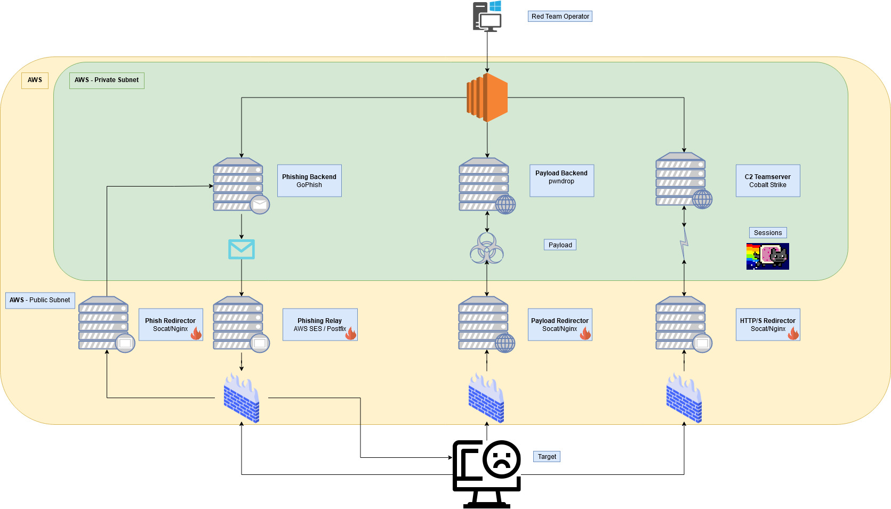
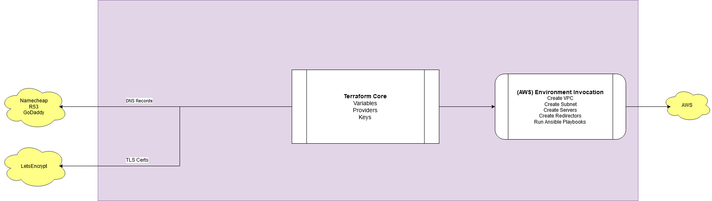

# Introducing Red Ira - Red Team Infrastructure Automation Suite

## Red Team Infrastructure

### Industry Context

There are many great pre-existing resources among the information security community pertaining to Red Team Infrastructure, why it's needed and best practices in terms of deployment and automation. Some recommended reading preceding this article would be [Rasta Mouse's Blog](https://rastamouse.me/blog/terraform-pt1/) as well as [spotless'](https://www.ired.team/offensive-security/red-team-infrastructure/automating-red-team-infrastructure-with-terraform).

In short, the security industry, technology companies, and enterprises are increasingly utilizing infrastructure-as-code and configuration-as-code approaches to automate the menial tasks of IT provisioning. The days of spinning up new machinery, logging in and configuring software will never end, but the effort which is required becomes exponentially compact as professionals take advantage of "DevOps" software. DevOps provides assurances of repeatability and flexibility across any size infrastructure, freeing up IT teams and System Administrators to work on more important tasks. The true power of DevOps is unleashed when development efforts can be managed, codified, tested and deployed flexibly and automatically, requiring human intervention only when the changes at hand impede the [continuous integration & deployment process](https://www.atlassian.com/continuous-delivery/principles/continuous-integration-vs-delivery-vs-deployment).

In the context of so-called "OffSecOps" (offensive security operations), the industry is increasingly favoring malleability and resilience when running offensive information security campaigns. OffSecOps often encompasses multiple facets of the traditional security engagement in addition to more modern, adversarial emulation scenarios. Crafting the infrastructure in such a way that is both quickly tailored to the target, as well as flexible in the face of competing Blue Teams is paramount.&#x20;

The [Red Team Infrastructure Wiki](https://github.com/bluscreenofjeff/Red-Team-Infrastructure-Wiki) hashes out specifications of building good Red Team Infrastructure in precise detail, and serves as a great reference for any Red Team looking to supercharge their operations. As [harmj0y ](https://twitter.com/harmj0y)outlined in his [phenomenal SO-CON 2020 talk](https://www.youtube.com/watch?v=XaICChBJMck), OffSecOps automation doesn't end at infrastructure & configuration - but can be extended to every limb of the offensive security lifecycle. From payload development, social engineering, C2, all the way to post-exploitation tasks & reporting - OffSecOps really sets the sky as the limit for security ops moving forward. Security teams can no longer ignore the impending wave of the DevOps revolution occurring industry-wide, lest they do so at the peril of their own cost & time.

### Project Purpose

I set out to begin automating Red Team Infrastructure and software configurations that could be tailored easily to individual client engagements, as well as created, maintained and destroyed in the cloud with ease. For this first iteration, a full Cobalt Strike C2 as well as a Gophish server with SMTP relaying would need to be working out-of-the-box, with minimal setup required. Each deployment would include the following:

* LetsEncrypt signed TLS for each domain
* Pre-configuration of each application
* Pre-populated DNS, such as A, NS, DKIM and SPF records
* Malleable redirectors fronting each application

Simplifying and serializing the state-changing operations into a single ingestion point, as well as leveraging file formats which could be easily consumed by micro-services would allow for the framework to be implemented into an Offensive CI pipeline in the future. Furthermore, I wanted to offer more granular network isolation using AWS than was offered in previously developed tools. Depicted below is the project's phase 1 initial architecture proposal (fireballs indicate burnable infrastructure) :



## Software Considerations


At the time of writing, I have no association with any of the software companies mentioned in this blog, and all of my opinions are strictly preference based.


Selecting an infrastructure-as-code and configuration-as-code framework is the first step taken in architecting a continuous integration scheme. The following design parameters were selected:

* Repeatability: Ease-of-scale and extensible programming features
* Malleability: Create, modify and destroy the deployments at will
* Idempotency: Ease-of-development & ability to change production deployments on the spot
* Pick what works: Strong preference for a tool set which SMEs in the industry already use and have made available, so as to save development time and complexity costs

Ultimately, Terraform and Ansible were selected, with justifications outlined in the following sections. Fundamentally, the choice came between choosing a containerized orchestration route and resource-based management. The containerized approach of using a technology like Kubernetes with Docker is powerful due to its ability to rapidly deploy predictable containers that 'just work', and to drive deployments at scale. While K8s checked the repeatability box, the other 3 considerations strongly favored the Terraform / Ansible stack.&#x20;

### Terraform

[Terraform](https://www.terraform.io)'s strength lies in its ability to quickly construct bare-bones infrastructure on[ any number of managed cloud providers and open source cloud hosting stacks](https://registry.terraform.io/browse/providers), using the straightforward [HCL declarative configuration language](https://github.com/hashicorp/hcl) that Hashicorp came up with. HCL & Terraform are [built on graph theory](https://www.youtube.com/watch?v=Ce3RNfRbdZ0), providing a level of modularity which allows for components to be seamlessly abstracted and built upon, even with a minimal knowledge of the language. Furthermore, it allows for the [core Terrform workflow](https://www.terraform.io/guides/core-workflow.html) to be dead simple, allowing not only for scale across multiple teams and deployments, but for ease of use both in an automated CI environment as well as a manual CLI operation.&#x20;

There are several approaches to team-based Terraform deployments, each with its own individual merits. For example, SaaS services such as [scalr](https://scalr.com) and [Terraform Cloud](https://www.terraform.io/docs/cloud/index.html) exist to manage concurrent Terraform automation modules across teams. With a strong preference to open source and a being a huge fan of [Gitlab,](https://about.gitlab.com) ChatOps, and [xpn's previous work on Terraform / Ansible based security integration in Gitlab CI](https://blog.xpnsec.com/testing-redteam-infra/), I favored an approach which would allow for 'plug-n-play' deployments. In other words, tuning a Gitlab CI pipeline to serialize simple changes, which would be picked up as a state change for complex Terraform / Ansible configuration management within the pipeline. This is discussed more in-depth in the [Typical Use Cases section](broken-reference).

For the last couple of years, infosec players such as [Rasta Mouse](https://twitter.com/\_rastamouse), [spotless](https://twitter.com/spotheplanet) and [byt3bl33d3r](https://twitter.com/byt3bl33d3r) have all embraced Terraform as a go-to for rapid infrastructure construction as well, which is discussed in greater detail in the [Existing Offensive Toolkits section](broken-reference).



### Ansible

Like most software ecosystems, DevOps tool chains have many strong opinions preceding them, and [Ansible ](https://www.ansible.com)is no stranger to phrases such as "why not just use Docker Compose?!" Ansible's fundamental flaw is the playbooks which comprises its configuration-as-code operations can be broken easily by an upstream repository / dependency change, depending on where & how the configuration is being invoked. With Docker containers, you know exactly what to expect when you run the container, or so we are told (this obviously changes as Docker compositions become more complex and contain more and more containers).&#x20;

From an offensive security perspective, Ansible really shines in its idempotency and [inventory system](https://docs.ansible.com/ansible/latest/user\_guide/intro\_inventory.html). This allows for intentional, concurrent [configuration drift](https://shadow-soft.com/ansible-idempotency-configuration-drift/) to occur on multiple machines at any given point in time. For example, if a systemd unit needed to be modified, Ansible would only modify the machines' states based on any (if any) changes in the playbook in relation to what is already present/missing on the target. Imagine a scenario in which a blue team discovers C2 infrastructure: you would want to stop all services until a certain point in the future, in order give your team some buffer time to switch to a backup domain for the remainder of the engagement, before quickly re-deploying.&#x20;

The combination of the core Terraform workflow and Ansible's idempotent aware configuration-as-code model make for a flexible framework of maintaining multiple pieces of infrastructure at scale, with speed and simplicity baked in as the design philosophy of the frameworks themselves.

### Existing Offensive Toolkits

With any new project, it is almost always best to pick something that is already proven to work and build upon it to suit the use case. The following projects were identified and analyzed for usability, active maintenance, and underlying stack:

[byt3bl33d3r's Red Baron project](https://github.com/Coalfire-Research/Red-Baron)

[lsuto & discoking's kubered project](https://github.com/cloudc2/kubered)

[spotless' Blog Experiments](https://github.com/mantvydasb/Red-Team-Infrastructure-Automation)

## Red Ira Software Design & Summary

### Baseline Project

Red Baron was chosen as the baseline software; with maintenance as recent as 2 years in the past, with multiple contributors to the code base, it would most closely fit the criterion for the software considerations posed in the previous section. In addition to its well-established Terraform modules, the following features were very useful and saved alot of time in initial development:

* Project structure for AWS and other common cloud providers
* SSH key & config write-outs
* Rudimentary Ansible integration

### Design Decisions

Due to the following design decisions, I spun a new project rather than forking Red Baron:

* Deployments would require modification of cut-and-dry configuration JSON templates only, for future micro-service / CI ingestion
* All configuration would be done by Ansible, automatically.
  * In-line scripts would remain an option (recommended against), but be removed.
* Top-level modules would be created through stacked Terraform sub-modules, to make composition easier in the future
* Publicly facing assets would only expose ports & services necessary for their core offensive function to the internet.
  * All administrative functions to be exposed to the internal operators' private network only.
  * Underlying infrastructure would be obscured to external parties.

Since the original project was based on an infamous WW1 fighter pilot, I named the project after [Richard Ira Bong](https://en.wikipedia.org/wiki/Richard\_Bong), an American WW2 Ace and Medal of Honor recipient.

### Improvements Summary

The following improvements (in a nutshell) were made to the original Red Baron code:

* Terraform upgrade to v0.14.4
  * Includes new Terraform syntax paradigms, such as :
  * Non-interpolated variable invocation
  * explicit `depends` patterns
  * local variables
  * Upgraded acme providers
* Complete, hands-off Cobalt Strike and Gophish Ansible playbooks
  * Using up-to-date software distros: Ansible v2.10.4 (via python3), Cobalt Strike 4.2, and Gophish 0.11.0
  * Added J2 templates & C2 profiles that can be fed into the playbooks.
* Cleaned up code
  * Removed count where unnecessary
  * Simplified outputs
  * Simplified modules
  * Added explicit type constraints where possible
* Boilerplate base variable files for unmanaged infrastructure declaration
* Deployment specific module abstractions (infra as well as Ansible modules)
  * Cobalt strike, Gophish

## Red Ira Software Implementation


Currently, Red Ira is implemented only for AWS.


### Network Isolation

As [outlined in the Red Team Infrastructure Wiki](https://github.com/bluscreenofjeff/Red-Team-Infrastructure-Wiki#securing-infrastructure), securing Red Team Infrastructure encompasses standard defense-in-depth measures such as limiting service exposure, employing access control policies, and keep machines up to date. Red-Baron was a bit lenient with the standard[ inbound port exposure,](https://github.com/Coalfire-Research/Red-Baron/blob/master/modules/aws/dns-c2/security\_group.tf) so a least-privilege model was implemented to isolate all back-end infrastructure, with the redirectors being solely exposed to the internet with their respective functional service port(s).&#x20;

This model requires that the creation of a VPC, private subnet, public subnet, and any custom security groups applying to those subnets within the [environment\_variables.auto.tfvars.json](https://github.com/joeminicucci/RedIra/blob/master/environment\_variables.auto.tfvars.json.template) file. The automation of VPC & subnet creation was not needed by my team in phase 1, but is consideration for the [next release](redira.md#future). This is outlined in the [README](https://github.com/joeminicucci/RedIra/blob/master/README.md). The [base\_variables.tf](https://github.com/joeminicucci/RedIra/blob/master/base\_variables.tf) file works in conjunction with the [environment_\__variables file](https://github.com/joeminicucci/RedIra/blob/master/environment\_variables.auto.tfvars.json.template) by carrying unmanaged variables, such as AMI IDs, across deployments without the need to re-define them per module. [base\_variables.tf](https://github.com/joeminicucci/RedIra/blob/master/base\_variables.tf) files are then placed in each module's folder to represent those unmanaged variable provisions at runtime when Terraform builds its DAG for that module.

### Cut and Dry Variable Inputs

In its current state, Red Ira can be fed the required variables for any given deployment using a [deployment's corresponding JSON file](https://github.com/joeminicucci/RedIra/tree/master/deployments/aws), or [as variables through the command line](https://www.terraform.io/docs/language/values/variables.html#variables-on-the-command-line). For example, the [complete AWS deployment template is implemented in JSON](https://github.com/joeminicucci/RedIra/blob/master/deployments/aws/complete/aws\_complete.auto.tfvars.json.template) as follows, allowing for any number of Cobalt Strike C2 and Gophish phishing deployments to be spawned concurrently:

```
{
  "http-c2-amount": 1,
  "http-c2-user": "admin",
  "http-c2-domain-mappings": [
    "",
  ],
  "http-c2-profile": "",


  "dns-c2-amount": 1,
  "dns-c2-user": "admin",
  "dns-c2-domain-mappings": [
    "",
  ],
  "dns-c2-profile": "",

  "cs_license": "",

  "phishing-amount": 1,
  "phishing-user": "admin",
  "phishing-domain-mappings": [
    "",
  ]
}
```

### Module Abstractions

Since Terraform was designed from the ground-up with modularity in mind, my opinion is that best practice should include repeatable modules which adhere to a single responsibility and can easily be copied around as boilerplate code. &#x20;

#### Ansible Abstractions

Invoking Ansible through Red Baron, or any Terraform code, is a bit of a hack. Furthermore, it is often recommended to keep configuration separate from Infrastructure. Some benefits of separation are:

* Allows for easier root cause analysis when the pipeline errors out
* Keeps discrete language functionality, i.e. Terraform & Ansible, separate so as to improve readability maintainability in a build

In the case of CI builds, I found it advantageous to keep Ansible invocations nested within Terraform modules, so that infrastructure I/O could be more seamlessly integrated with configuration inputs. For example, a Cobalt Strike deployment would need to know public IP addresses of the deployment as well as a TLS keypair, and SSH key. Since the majority of these items were already defined as Terraform I/O variables, connecting the Ansible kickoff within Terraform also prevents the possibility of variable de-synchronization in a future build; which is likely in the former approach of tracking Ansible separately in the CI definition.

The [original Red Baron Ansible implementation](https://github.com/Coalfire-Research/Red-Baron/tree/master/modules/ansible#example) required providing base variables in the Ansible module to communicate, and in-lined the necessary variables for a particular playbook as `--extra-args`:

```csharp
module "ansible" {
  source    = "./modules/ansible"

  user      = "${http_c2.ssh_user}"
  ip        = "${http_c2.ips[0]}"
  playbook  = "/path/to/playbook.yml"
}
```

I used this module as a base to construct [playbook specific modules](https://github.com/joeminicucci/RedIra/tree/master/modules/ansible), first by modifying the provisioner to run on `python3` and inline the inventory rather than creating a dynamic inventory. In this manner inventory doesn't need to be tracked, and each Ansible module is invoked in separate instances per each definition. Constructing a dynamic inventory will most likely be needed in the future, as more complex playbooks are invoked, [for example RedELK](https://github.com/curi0usJack/ansible-redelk).

```csharp
command = "ansible-playbook ${join(" ", compact(var.arguments))} --user=${var.user} --private-key=${local.ssh-keys-path}/${var.ip} -i ${var.ip},${join(" -e ", compact(var.envs))} --extra-vars 'ansible_python_interpreter=/usr/bin/python3' ${var.playbook}"
```

#### Cobalt Strike & Gophish Ansible Modules

Using the [base Ansible module](https://github.com/joeminicucci/RedIra/tree/master/modules/ansible/core), abstracting the [Cobalt Stri](https://github.com/joeminicucci/ansible-role-cobalt-strike/)[ke role I created (with the help of chryzsh)](https://github.com/joeminicucci/ansible-role-cobalt-strike/) into a Terraform module was relatively straightforward. First the variables which are needed by Ansible are tracked within a Terraform [variables.tf file](https://github.com/joeminicucci/RedIra/blob/master/modules/ansible/cobalt-strike/variables.tf), as follows:

```csharp
locals {
  ansible-config-playbook = "${local.playbook-path}/core_config.yml"
  ansible-cs-playbook = "${local.playbook-path}/cobalt_strike.yml"
}

variable "ansible-user" {
  type = string
}

variable "ip" {
  description = "Host to run playbook on"
  type = string
}

variable "domain" {
  description = "C2 Domain to host from"
  type = string
}

variable "cs-license"{
  type = string
}

variable "bind-address"{
  type = string
}

variable "teamserver-password"{
  type = string
}

variable "c2-profile"{
  type = string
}

variable "arguments" {
  default = []
  type    = list(string)
  description = "Any additional Ansible arguments to pass in."
}

variable "envs" {
  default = []
  type    = list(string)
  description = "Environment variables to pass in. Will be delimited by -e automatically."
}

```

The role is then [invoked following another call](https://github.com/joeminicucci/RedIra/blob/master/modules/ansible/cobalt-strike/main.tf) to a core\_config.yml playbook as:

```csharp
module "cs-config-ansible"{
  source = "../core"

  #managed
  user = var.ansible-user
  playbook = local.ansible-config-playbook
  ip = var.ip
}

module "cs-ansible"{
  source = "../core"
  depends_on = [module.cs-config-ansible]

  user = var.ansible-user
  playbook = local.ansible-cs-playbook
  arguments = concat(["--extra-vars 'license_key=${var.cs-license} bind_address=${var.bind-address} teamserver_password=${var.teamserver-password} c2_profile=${var.c2-profile} domain=${var.domain}'"], var.arguments)
  ip = var.ip
  envs = var.envs
}
```

The [core\_config.yml playbook](https://github.com/joeminicucci/RedIra/blob/master/data/playbooks/core\_config.yml) contains the following core dependency installs through apt, and is a replacement for the [original inline script invocations that Red Baron utilized](https://github.com/Coalfire-Research/Red-Baron/blob/master/data/scripts/core\_deps.sh):

```csharp
- name: Core Configuration
  hosts: all
  tasks:

    - name: Install core deps
      apt:
        name:
          - curl
          - tmux
          - git
          - dirmngr
          - debconf-utils
          - wget
          - build-essential
          - vim
          - gcc
        update_cache: yes
        state: latest
      become: yes
      tags: update
```

The Gophish Ansible module uses the same approach and can be [found here](https://github.com/joeminicucci/RedIra/tree/master/modules/ansible/gophish).

#### Cobalt Strike & Gophish Infrastructure Modules

After abstracting the implementation specific Ansible modules, the entire infrastructure module is put in place, which:

1. Spins up the relevant EC2 instances
2. Sets DNS records in Route53
3. Creates TLS keypair with LetsEncrypt
4. Runs the Ansible module

Below is an example of a [Cobalt Strike HTTP C2](https://github.com/joeminicucci/RedIra/tree/master/modules/aws/http-c2) implementation:

```csharp
resource "random_password" "http-cs-teamserver-password" {
  length = 15
  special = true
  override_special = "@%)-_+[}:"
}

module "http-c2" {
  source = "../http-c2"

  #managed
  user = var.cs-http-c2-user
  subnet_id = var.private_subnet_id
  instance_type = var.instance_type
  security_groups = var.base-internal-security_groups
  security_groups_inbound_http = var.base-public-security_groups

  #base
  vpc_id = var.vpc_id
  amis = var.amis
}

module "http-rdir" {
  source = "../http-rdir"
  depends_on = [module.http-c2]

  #managed
  user = var.cs-http-c2-user
  subnet_id = var.public_subnet_id
  instance_type = var.instance_type
  security_groups = var.base-public-security_groups
  redirect_to = module.http-c2.http-c2-private-ip

  #base
  vpc_id = var.vpc_id
  amis = var.amis
}

module "http-rdir-A-records" {
  source = "../create-dns-record"
  depends_on = [module.http-rdir]

  #managed
  domain = local.cs-http-c2-tld
  type = "A"
  record = {
    (var.cs-http-c2-domain) = module.http-rdir.http-rdr-public-ip
  }
}

module "http-c2-create-certs" {
  source = "../letsencrypt/create-cert-dns"
  depends_on = [module.http-rdir-A-records]

  #managed
  domain = var.cs-http-c2-domain
  subject_alternative_names = {
    (var.cs-http-c2-domain) = ["*.${var.cs-http-c2-domain}"]
  }

  reg_email = "${var.cs-http-c2-user}@${local.cs-http-c2-tld}"
  dns_provider = "route53"
}

module "http-c2-ansible"{
  source = "../../ansible/cobalt-strike"
  depends_on = [module.http-c2, module.http-c2-create-certs]

  #managed
  ansible-user = var.cs-http-c2-user
  ip = module.http-c2.http-c2-private-ip
  domain = var.cs-http-c2-domain
  bind-address = module.http-rdir.http-rdr-public-ip
  c2-profile = var.c2-profile
  cs-license = var.cs-license
  teamserver-password = random_password.http-cs-teamserver-password.result
}

```

#### Top Level Deployment Modules

Putting it all together, the [modules can be placed in a deployment](https://github.com/joeminicucci/RedIra/blob/master/deployments/aws/c2\_http/aws\_c2\_http.tf), with the above example being declared as simply as:

```csharp
module "cs-http-c2" {
  source = "./modules/aws/http-cobalt-strike"
  count = var.http-c2-amount

  #managed
  cs-http-c2-user = var.http-c2-user
  cs-http-c2-domain = var.http-c2-domain-mappings[count.index]
  cs-license = var.cs-license
  c2-profile = var.http-c2-profile

  #base
  vpc_id = var.vpc_id
  amis = var.amis
  instance_type = var.instance_type
  public_subnet_id = var.public_subnet_id
  private_subnet_id = var.private_subnet_id
  base-internal-security_groups = var.base-internal-security_groups
  base-public-security_groups = var.base-public-security_groups
}
```

## Typical Use Cases

### Gitlab CI

The following approach is essentially taking [Gitlab CI](https://docs.gitlab.com/ee/ci/) and transforming it into a MacGyver'd sclar/Terraform Cloud style workspace management system. The idea is to deploy the Infrastructure with simple Slack commands through Gitlab CI using [Gitlab ChatOps](https://docs.gitlab.com/ee/ci/chatops/index.html). This approach will be covered more in-depth in a future blog entry, but a typical workflow would execute as follows:

1. An operator would use a custom slash command in Slack, with the 'cut-and-dry' variables - i.e. the pared down variable requirements for each individual Red Ira deployment, as arguments. [Gitlab ChatOps](https://docs.gitlab.com/ee/ci/chatops/index.html) is perfect for this. Each particular customer environment would map to a Terraform workspace and the ChatOps command could be invoked as follows from Slack:

```
/red-ira run http-c2 [Customer_Name] [domain]
```

#### Workspace Management

The above command, on the back-end, would need to perform some workspace management. This is due to the way[ Terraform manages variables on disk directly when working with the open source CLI.](https://www.terraform.io/docs/cloud/workspaces/index.html#workspace-contents)

The following would need to be implemented, assuming the complete deployment would always reside in the root directory, as a [Ruby ChatOps command](https://gitlab.com/gitlab-com/chatops#adding-commands):&#x20;

1. Terraform `workspace` command for customer name (creates if doesn't exist)
2. The corresponding variables file, in this case aws\_complete.auto.tfvars.json,  would need to be renamed in a convention that could identify the customer,  for example, `aws_complete.Customer_Name.auto.tfvars.json`. This step can be avoided if the CI runners are made separately for each customer.
   1. If a pre-existing customer workspace is already deployed in the folder, the Ruby appends `.old` to the file extension, to ensure that Terraform doesn't pick it up. Concurrency is assured since the commands run on the same CI runner.
   2. If the same customer's variables file already exists, it is renamed back from `.old` back to `.json` and the JSON is appended to as directed from the slash command.
3. The corresponding Gitlab CI job is fired off.
4. Unit tests are run with unit testing frameworks such as [Molecule and InSpec](https://blog.xpnsec.com/testing-redteam-infra/).
5. Terraform `plan` and `apply` are invoked.
6. The job finishes or fails, and reports back to Slack the results via a [Slack webhook](https://api.slack.com/messaging/webhooks).

## The Code

[The code is open source and located here.](https://github.com/joeminicucci/RedIra)

## Future

There are a number of improvements that are planned for Red Ira in the future, including:

* [Pwndrop](https://github.com/kgretzky/pwndrop) for payload server
* Domain Fronting Implementation
* [RedELK](https://github.com/outflanknl/RedELK) Implementation
  * Dynamic Terraform created Ansible Inventories
* Hosted Zone / Create VPC implementation, as needed or if requested
* Molecule & InSpec integration tests

## References













