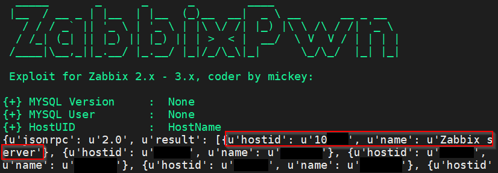
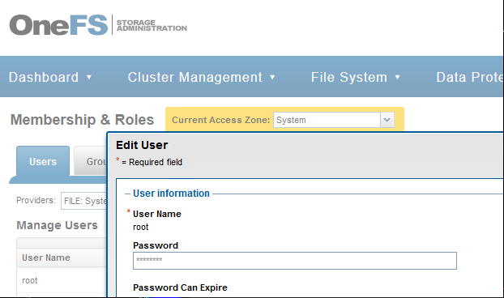

# Who Let the ARPs Out? - From ARP Spoof to Domain Compromise

## Setting the Stage

Often times internal penetration tests are so clear cut: the Blue Team gives you an account in AD, you fire up Bloodhound and get DA within a matter of hours or days. I recently was put on an engagement in which a client requested a simple dropbox to be deployed in a data center, as well as a low-level AD account to cover 2 assumed breach scenarios. The latter is what you would expect, an employee gets phished or their workstation compromised, and the attacker gains a low-level Active Directory account's access.

The latter scenario's intention was to emulate a threat using an off-the-shelf device to plug into a physically protected, albeit flat network broadcast domain, in which many operational & embedded data appliances were running.&#x20;

Since there was significant EDR, logging and Blue Team tripwires on the Windows side of the house, I decided to go with the data center breach scenario first. Generally speaking, many \*nix assets within enterprise organizations do not contain sufficient endpoint protection and/or security monitoring/response solutions, with the bulk of the focus going to Windows and AD.&#x20;


This blog post does not demonstrate any novel techniques or research, but rather demonstrates that often times old-school network attacks are still adequate in facilitating lateral movement and compromise of an entire enterprise network. It also highlights some major security fails from data appliance vendors' software, and how readily those appliances can be leveraged in a network compromise.


## Layer 2

As per a common internal offense MO, I ran LLMNR/mDNS poisoning (using [Repsonder](https://github.com/lgandx/Responder) / [Inveigh](https://github.com/Kevin-Robertson/Inveigh)) to attempt credential theft from any Windows endpoints authenticating within the environment. An [NTLM relay was also configured to target machines without SMB signing enabled](https://attack.mitre.org/techniques/T1557/001/) to gain potentially easy footholds. &#x20;


Ruling out the existence of AD in an environment can be as simple as scanning for traditional domain controller service signatures, e.g. msrpc, microsoft-ds, dns, ldap, smb, rdp, kerberos etc. Even if the DC is in another segment of the network, you may discover endpoints which could be exploited for a foothold.


### BetterCap

Continuing the Layer 2 attacks in the hopes of catching a low-hanging fruit, it was time to get a taste of the old-school with some [ARP spoofing](https://attack.mitre.org/techniques/T1557/002/).

[BetterCap ](https://www.bettercap.org/)is a superb tool network attack tool written by [@evilsocket](https://twitter.com/evilsocket). Due to its maturity, it has become my go-to for Layer 2 attacks & ARP spoofing, rather than [Ettercap](https://www.ettercap-project.org/) (a great project also). To perform the ARP spoof:

1. Gather a list of target IPs with services known to pass credentials, e.g. `http` &#x20;
2. Set those targets in the [arp.spoof module of BetterCap](https://www.bettercap.org/modules/ethernet/spoofers/arp.spoof/)
3. Turn on the `arp spoof` module in full duplex model to ensure that the attack endpoint acts as an interception router
4. Run the [net.sniff](https://www.bettercap.org/modules/ethernet/net.sniff/) module to look at the traffic

## Attack Chain

### HTTP Foothold

The results came in quick, with what appeared to be a live session over a non-secure HTTP negotiation to a [Zabbix](https://www.zabbix.com/) server:


Placing the cookie into a browser indeed verified session access, along with a version number indicated in the server response:


With a simple search of [exploitdb](https://www.exploit-db.com/), the [ZabbixPwn script ](https://github.com/RicterZ/zabbixPwn/blob/master/zabbixPwn.py)was used to leverage a SQL injection vulnerability in the PHP JSON RPC service. I modified the exploit to ignore username/session discovery since the call was returning errors on the particular Zabbix 3.0 deployment, and hard-coded the sessionId.

The hosts returned contained a Zabbix server ID which is used by ZabbixPwn to gain a webshell:




The webshell was then upgraded with a Bash reverse shell one-liner and upgraded to a PTY with pre-installed Python:


With the foothold complete, I quickly installed [low-privelege systemd persistence](https://medium.com/@alexeypetrenko/systemd-user-level-persistence-25eb562d2ea8) to ensure ongoing access to the box.

### Lateral Movement

#### Credential Discovery

Taking an inventory of the compromised machine for privilege escalation, a tcpdump pcap was run passively for about an hour. Multiple protocols should be added to this one-liner depending on the environment. Here are some useful services commonly sniffed: `http/s, smb, dns, smtp, pop3, imap, ftp, snmp`. A TCP wildcard could be used but be wary of filesizes, especially when operating on a foothold. Filtering is used to target exploitable use cases as well as prevent large pcaps from accumulating and effecting operability of the machine.

```
tcpdump -i any -s 0 'tcp port http or tcp port https' -w /tmp/http.cap
```

When analyzed, this dump revealed more HTTP servers than initially discovered in the initial nmap / [ARP scans](https://github.com/alexxy/netdiscover). Server credentials for an undisclosed appliance vendor were discovered within a recurring HTTP transaction. These credentials were later found to have existed in the former bettercap ARP spoof as well, albeit occurring at lengthier intervals.


The following server appliance compromise does not include screenshots or vendor information. The vendor was contacted and has thus far not accepted the issues identified as security issues. Until correspondence is complete, this section will remain redacted.


After logging into the appliance with the compromised credentials, there was a simple script runner GUI located within the web interface; which was made quick work of with another Bash reverse shell. With a shell session on the appliance, credentials for a Dell OneFS DFS server were discovered in an environment variable:


### DFS Compromise

Using the OneFS credentials in hand, the OneFS administration portal was found to have the a crucial DAC misconfiguration in place: the allowance of low privilege users to write high privilege users' access primitives. Using the web UI, the admin user's password was changed via the compromised low privilege account, and ssh password authentication was granted with the newly set password.




### Share Enumeration

#### SMB Discovery

Referencing the Isilon OneFS CLI commands [in the official documentation](https://www.delltechnologies.com/en-us/collaterals/unauth/technical-guides-support-information/products/networking-4/docu84281.pdf), many interesting functions were found to be available. Simple SMB share commands were identified for the purpose of streamlining share enumeration from the SSH session. The names of the shares were dumped in a temporary file using the following Bash one-liners:

```
% isi smb shares list | cut -d '-' -f3 | cut -d ' ' -f1
% isi smb shares list | cut -d ' ' -f1
```

To change the permissions of the target share, the web UI or the following `isi` command could be used:

```
% isi smb shares permission create <share>
```

To test the new privileges, in Linux cifs-utils can be used as follows:


```
mount -t cifs -o username=<user>,password=<password> //<host>/<share> /mnt
```

In Windows, the cmd net utils also would work to check access:

```
net use '\\<host>\<share>' "<password>" /u:<host>\<user>
```

As can be seen from the filesystem size, I had clearly hit the mother-load with \~682 terrabytes of live data available throughout the DFS cluster:


#### Targeted Looting

Instead of granting access to every share, important looking financial, PII, and security shares were targeted first. I switched to the Windows machine out of preference for Powershell over bash, which, while domain joined, would also be able to access the shares in a non-domain joined breach scenario (i.e. Windows dropbox). The Powershell below demonstrates some of the generic enumeration executed to find sensitive info / demonstrate impact, and generally wouldn't flag most EDR unless a strong emphasis was placed on Powershell logging.&#x20;


There are many other Powershell looting scripts and search patterns all over the internet, left as an exercise for the reader. Powershell is truly fantastic :)


```csharp
#passwords
Get-ChildItem -Path “c:\users\” -Recurse -Force -Include *.doc, *.docx, *.xls, *.xlsx, *.txt, *.pdf, *.ppt, *.pptx | Select-String “[P|p]assword” | Select-Object Path, Line, LineNumber | Export-Csv “c:\passwordPII.csv”
Get-ChildItem -Path "C:\Users” -Recurse -Force -Include *.doc, *.docx, *.xls, *.xlsx, *.txt, *.pdf, *.ppt, *.pptx | Select-String “[P|p]assword” | Select-Object Path, Line, LineNumber | ConvertTo-Csv | Tee-Object -File ./file.csv | ConvertFrom-CSV
```

As targeted loot searches ran in the background, the manual search through shares to find easy wins continued. Some quick finds included private SSL keys, Bitlocker key backups,  and SIEM logs:


More importantly, I discovered a folder which appeared to contain a multitude of Domain Controller backups:


After exfiltrating these files to an offline Windows box, I mounted one of the backups and found the NTDS database intact, ready to be dumped.


### Domain Compromise

At this point, it is basically Game Over for the enterprise. Using [DSInternals](https://github.com/MichaelGrafnetter/DSInternals/blob/master/Documentation/PowerShell/Get-ADDBAccount.md#example-2), the boot key was extracted into memory, and the NTDS database dumped, yielding the hashes for every account in AD (numbering over 120,000), including the Kerberos ticket granting account (krbtgt). Leveraging Hashcat with several custom rules on an [Amazon G3 instance with 4 Nvidia Tesla M60 GPUs](https://aws.amazon.com/ec2/instance-types/g3/), 30,000+ passwords were successfully cracked within the first 6 hours, including a Domain Administrator account. Moreover, the Enterprise Administrator's account was included in the dump, and due to the copious number of SMB instances exposed in the network, [SMB code execution](https://github.com/byt3bl33d3r/CrackMapExec/wiki/SMB-Command-Reference) became trivial on many of the AD endpoints.


At this point, I decided to operate a little more loudly, as the main objectives for the client had been complete. The following actions were executed on the initial access Windows machine:

* Escalating to local admin using [JuicyPotato](https://github.com/ohpe/juicy-potato)
* Dropping a custom mimikatz shellcode loader onto disk
* Crafting Golden Tickets using the krbtgt account's hash


To re-cap, the level of compromise at this point included the following:

* \~25% of all AD accounts fully compromised, 100% of user hashes exposed
* Multiple sessions established on workstations and Domain Controllers with EA level access on both in-scope domains
* Access to the entirety of the enterprise's internal DFS data stores
* Golden tickets crafted for further [PTT lateral movement](https://attack.mitre.org/techniques/T1550/003/)

### Further Looting

With stealth no longer being necessary to the engagement, I played with my new favorite data discovery tool, [Snaffler](https://github.com/SnaffCon/Snaffler). Besides the great decision to write the tool in C# (one of the best programming languages of all time!), the tool offers a very powerful custom data classification engine, as well as machine & share discovery functionality. I continued combing various pieces of PII and financial data for good impact demonstration, and despite performing many thousands of searches on multiple threads across the entire domain, the Blue Team remained unnervingly quiet until reaching the end of the engagement.

## Takeaways

### Underfunded Blue Team

This enterprise network faces a common issue known too well amongst many underfunded Blue Teams: the fatal assumption that the perimeter is what truly matters, and that beyond the perimeter Windows is the end-all security game. If the Blue Team had proper IT funding, it is my opinion based on many conversations that further action would have been taken, and further controls implemented, in order to better secure the data center.&#x20;

### Defense Wins

While the data center was insufficiently protected, the AD environment itself had clearly undergone a much more thorough security review, including some common sense measures:

* Tight ACL / least privilege AD object relationships
* EDR on every machine
* Up-to-date endpoints / Domain Controllers
* Baseline Powershell logging

## Debrief & Defense Recommendations

### Top-Down Security

The assumptions that decision makers in the enterprise carry & execute, if made unilaterally, can adversely effect network security to insane levels as seen in this assumed breach scenario. This particular organization had copious amounts of capital, and the Blue Team brought in pentesters to advocate more comprehensive funding for their team.&#x20;

A malicious party would only have required an off-the-shelf dropbox device and physical access to the data center to completely compromise a large portion of the entire organization. If physical access seems like an outlandish threat scenario, I recommended checking out the fantastic work of [Jayson Street](https://www.youtube.com/watch?v=JsVtHqICeKE) and/or [Deviant Ollam](https://www.youtube.com/watch?v=mj2iSdBw4-0).&#x20;

Assuming that defending the perimeter is the silver bullet to an organization's security program is a terrible mistake. Whether its through social engineering, a novel zero day, an unpatched file server or a rogue device on premise (see my [2018](../2018/hunting-rogue-access-points.md) and [2019 ](../2019/wireless-implant-c2-security-ops.md)blogs), determined attackers will adjust their methods asymmetrically when approaching your defenses. There is never, has never, and never will be a silver bullet.

### Baseline Security

In any internal breach scenario, Active Directory security is extremely important; however other common defense-in-depth deterrents should be placed throughout the infrastructure to address some of the more basic, 'old-school' attacks against the enterprise:

* A progressive security program with equal input across the **entire** IT constituency.
* EDR products backed by good threat intelligence
* A fine-tuned SIEM
* Network segmentation
* An IDS that is tuned to the typical \*nix attack chains (and feeds back to the SIEM, naturally)

### Data Exposure

In environments such as this in which large amounts of sensitive & valuable data are exposed in singular data systems / points of failure:

* Perform periodic, comprehensive audits
  * Include threat modeling & inventory of any external applications / appliances with which it interacts, or may interact with in the future
  * Scrutinize access controls and regularly review logs

### Closing Thoughts

Security is a perpetual game of prioritization, resource allocation and perspective. Threats that are swept 'under the rug' may come back to bite an entire organization at unimaginable scale, so it is always best to err on imagining the unimaginable. Regardless of whether the propositions brainstormed are affordable, or within budget/scope of the current business initiatives, it never hurts to play wargames and draw attention to areas of the infrastructure that otherwise may have been neglected.&#x20;

All security starts with awareness, and while approaching the threat landscape with 2 eyes open may not pay dividends, it also may not cost a company an unforseen fortune in the future.
